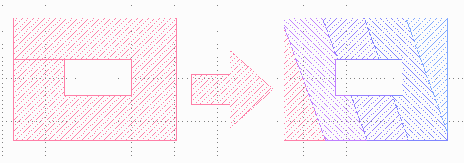
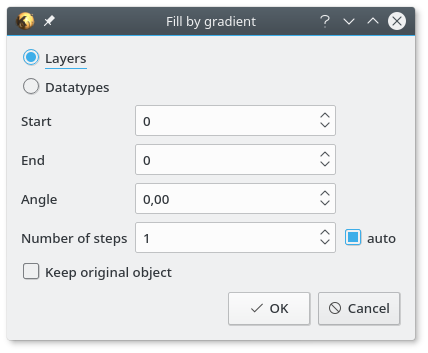

Gradient Tool
=============

KLayout tool for filling objects by linear layer/datatype gradients

Installation
------------

Install through KLayout package manager. Alternatively you can clone the repository into ~/.klayout/salt/GradientTool.

Usage
-----
Tool can be accessed through Edit -> Selection -> Fill by gradient. It will fill selected object by layer or datatype gradient.

- Layers/Datatypes - specifies, if the gradient should by done by layers preserving the original datatype, or by datatypes preserving original layer
- Start - layer/datatype of first gradient segment
- End - layer/datatype of last gradient segment
- Angle - gradient orientation
- Number of steps - number of gradient segments
- Keep original object - if not checked, original objects will be deleted
